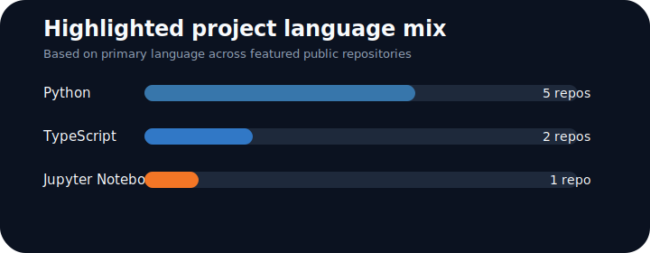

# Kanish Mehan

CS final-year at TIET with internship experience across full stack, AI, and analytics. I build end-to-end products around GenAI, RAG, data systems, and practical business workflows.

<!-- PROFILE:START -->
## About

- Based in Gurugram
- Current focus areas from public work: AI agents, data tooling, financial workflows, and full-stack product builds
- Bio evidence: MERN, GenAI, RAG, Power BI, and end-to-end project delivery
<!-- PROFILE:END -->

## What I build

- AI-assisted analytics tools that turn raw business or dataset inputs into usable outputs
- Full-stack product prototypes with live deployment, backend services, and practical UX
- Applied ML and assistive-tech experiments with a clear problem-driven angle

## Tech stack

**Languages**

Python, TypeScript, JavaScript, Jupyter Notebook, HTML, CSS

**Frameworks and tools**

FastAPI, Flask, Streamlit, React, Vite, PostgreSQL, LangChain, pandas, matplotlib, Vercel

## Language footprint

This chart is based on the primary language of highlighted public projects, not repository byte counts.

<!-- PROJECTS:START -->
## Featured projects

### AgriSense
Accessible agricultural assistance platform for farmers in India with voice-enabled support across multiple regional languages, crop recommendations, and financial guidance.

**Stack:** Jupyter Notebook, AI/analytics workflow  
**Why it stands out:** Strong real-world problem framing and accessibility focus  
[Repository](https://github.com/kanish818/AgriSense)

### LiteKite
End-to-end mock stock exchange app with real-time price flows, AI portfolio analysis, and virtual trading.

**Stack:** TypeScript, React/Vite, Flask, PostgreSQL, Vercel  
**Why it stands out:** Full-stack architecture plus a live demo  
[Repository](https://github.com/kanish818/LiteKite) • [Live demo](https://lite-kite-1hag.vercel.app/)

### AutoAnalyst-Agent
AI-powered data companion for dataset querying, visualization, and insight generation across CSV, Excel, JSON, Parquet, and text inputs.

**Stack:** Python, FastAPI, LangChain, Google Generative AI, pandas, seaborn, matplotlib  
**Why it stands out:** Multi-format data handling with analyst-focused workflow design  
[Repository](https://github.com/kanish818/AutoAnalyst-Agent)

### Analyst-Copilot
Modular web app that converts company financial context documents into downloadable research PDFs with confidence, citation, and data-quality surfaces.

**Stack:** Python, Streamlit, Groq API, pypdf, pandas, reportlab, matplotlib  
**Why it stands out:** Clear business use case, structured pipeline design, and document-to-report automation  
[Repository](https://github.com/kanish818/Analyst-Copilot)

### Deep-Query-Agent
Natural-language query agent for CSV files and SQL databases with read-only guardrails and transparent query generation.

**Stack:** Python, SQL, pandas  
**Why it stands out:** Focus on safe querying and explainable results for data workflows  
[Repository](https://github.com/kanish818/Deep-Query-Agent)

### Anveshan-Onbaordin-Prototype
Deterministic onboarding automation prototype that converts HR source files and policy rules into auditable action plans, escalations, and digest outputs.

**Stack:** Python, Streamlit, rule-based workflow automation  
**Why it stands out:** Strong emphasis on auditability, reproducibility, and operational usefulness  
[Repository](https://github.com/kanish818/Anveshan-Onbaordin-Prototype)
<!-- PROJECTS:END -->

<!-- STATS:START -->
## GitHub snapshot

- Public repositories: `26`
- Followers: `2`
- Following: `8`
- Highlighted repo language mix: `5 Python`, `2 TypeScript`, `1 Jupyter Notebook`
- Visible achievements on profile: `YOLO`, `Quickdraw`
<!-- STATS:END -->

## Recent public work

- `Analyst-Copilot` updated on May 31, 2026
- `AutoAnalyst-Agent` updated on May 18, 2026
- `AgriSense` updated on May 17, 2026
- `LLM-Distillation` updated on May 12, 2026
- `LiteKite` updated on April 25, 2026

## Contact

- GitHub: [kanish818](https://github.com/kanish818)
- Location: Gurugram
